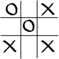
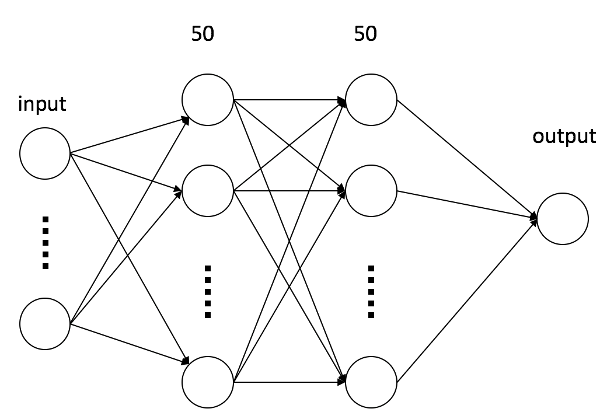

# tic tac toe examples
This is an example of using 

+ *alpha beta prunning*
+ *Deep Learning*
+ *MCTS search* and 
+ *Reinforcement Learning* 


methods to solve tic tac toe game
## Introduction to tic tac toe
Tic Tac Toe is 3x3 board game where player 0 and player 1 sequentially place 'O' and 'X' in one of the empty slots. When 3 'O's or 'X's align horizontally, vertically or diagonally, the corresponding player wins immediately.



This is a zero-sum game. Suppose winning will get score 1, lose -1 and tie will get score 0. 
**My opponent tries to maximize his score is equivalent to minimize my score.**

## Game environment

board is 3*3 array. ```get_status(board)```
gets the status of the board

+ 1: player 0 win
+ -1: player 1 win
+ 2: tie
+ 0: game is not over

```tournament(ai0,ai1)``` let ai0 player with ai1, ai0 uses 'O' and ai1 uses 'X'

```compare(ai0,ai1)``` compare the performance of ai0 and ai1 through many times of tournaments between them.

```interactive_play(ai,board)``` human play with ai


## minimax and alpha beta pruning

###minmax

Suppose I am a player, my goal is to win the game, or get score 1. When I have different choices of actions, the saftest thought is compare the worst (minimum) score of each choices, and choose the largest one. When my opponent thinks similarly, he will choose the action that minimize my maximum score. 


### alpha beta prunning
In tic tac toe, we can try every possible actions. However, we don't need to. When it's my turn, and I found that one action will give me socre 1, I will select this action and don't need to consider the other options. Similary, when it is my opponent's turn, he found an action that will make my score -1, he doesn't need to consider other options any more.

```alpha_beta_ai(board,player)``` will return the next step given board and player

## Policy Deep Learning
A policy is to map a state (board & player) to action. DL network is used to predict action from state.
state[p0,p1,p2,p3,p4,p5,p6,p7,p8,player]->action 0-8


####Data Acquisition
+ 100,000 games played by two random AIs.
+ Select one random state from one game
+ For each state, ask alpha\_beta\_ai what the next action is.



+ The network contains two hidden layers each with 50 nodes (decided by cross-validation)
+ The accuracy of network is around 0.99.
+ ```policy_ai(board,player)``` will give the next step predicted by DL network.

## MCTS + UCB
Instead of minmax, Monte Carlo Tree Search provides another way of selecting next action.

The basic idea of MCTS is that, when it's AI's turn to move, ai can simulate each choices and then play with itself (can be randomly) quickly many times. This process is also called rollout. The actual decision will be based on the statistics of self play.

But when time is limited and AI can only self-play finite times, which choice to calculate next? Upper Confidence Bound(UCB) provides a solution. 

When it is AI's turn to move, the current board state can be considerred as root node, each choices leads to a state of child node. AI can choose the child node with the maximum UCB to simulate self-play. 


where si is the total score of child node, ni is the times that node i is visited and n is the times its parent node is visited during self-play. After rollout, the statistics of node i and its parent (and parent's parent) are recursively updated.

The child node can be expanded based on the same UCB principle during MCTS, when, for example, the parent node has no unvisited child.

```UCT(board,player)``` returns the next move through UCT method. The default rollout ai is random_ai, but other methods can be used. ```UCT_policy_ai(board,player)``` returns the next move using policy_ai as rollout ai.

## Reinforcement Learning
A Q\_table is used to store the action values of states. Here only the states of player 0 (who uses 'O') are stored and calculated. States where it is player 1's move is deduced by symmetry. 


The ```q_learn_episode(opponent_ai,alpha=0.5,epsilon=0.5,gamma=0.9)``` function simulate an episode of play between reinforcement learning ai and opponent ai. RL ai is always player 0. During training, its selection is epsilon-greedy: with probability epsilon to choose random move and probability (1 - epsilon) to select the action with max Q(state,action). Then opponent ai takes an action and return state s'. Q(state,action) is updated according to max Q(s',action') and reward.


When RL ai makes a move, it immediately wins, then the reward is 1; when opponent makes a move and it immediately loses, the reward is -1, otherwise the reward is 0.

After training many times, ```q_learn_ai(board,player)``` returns the next move decided by the RL given the board state and player.


##Summary

This code provides the following AIs to decide next move in tic tac toe game.

+ ```random_ai(board,player)```
+ ```alpha_beta_ai(board,player)```
+ ```policy_ai(board,player)```
+ ```UCT(board,player)```
+ ```UCT_policy_ai(board,player)```
+ ```q_learn_ai(board,player)```

